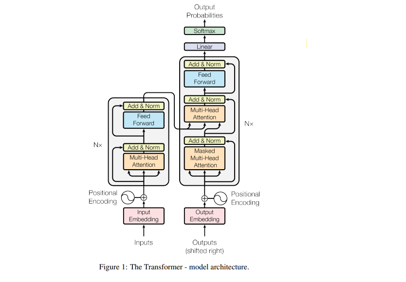

# nlp-with-transformers



# Transformer: A Comprehensive Guide

## Introduction
The Transformer model, introduced by Vaswani et al. in 2017, has revolutionized the field of natural language processing (NLP). Its unique architecture, based entirely on attention mechanisms, has enabled significant advancements in tasks like machine translation, text summarization, and sentiment analysis.

## Architecture Overview
The Transformer is based on an encoder-decoder structure:

1. **Encoder:** Processes input data and extracts meaningful features.
2. **Decoder:** Generates output sequences based on encoded information.

### Key Components
#### 1. **Attention Mechanism**
The attention mechanism allows the model to focus on relevant parts of the input sequence when producing each output. The primary type of attention used in Transformers is **Scaled Dot-Product Attention**, defined as:

\[
\text{Attention}(Q, K, V) = \text{softmax}\left(\frac{QK^T}{\sqrt{d_k}}\right)V
\]

Where:
- \( Q \): Query matrix
- \( K \): Key matrix
- \( V \): Value matrix
- \( d_k \): Dimensionality of the keys

#### 2. **Multi-Head Attention**
Instead of computing attention once, Multi-Head Attention applies the attention mechanism multiple times in parallel, allowing the model to learn different aspects of the input data.

#### 3. **Positional Encoding**
Since Transformers do not have a sequential structure like RNNs, positional encoding is added to input embeddings to provide the model with information about the position of tokens in the sequence.

#### 4. **Feed-Forward Network (FFN)**
A simple fully connected neural network applied to each position independently and identically.

#### 5. **Layer Normalization**
Normalization is applied to stabilize and speed up training.

#### 6. **Residual Connections**
Residual connections are added around sub-layers to prevent gradient vanishing and enhance information flow.

### Diagram
Below is a visual representation of the Transformer architecture:


*Source: Wikimedia Commons*

## Applications
Transformers have demonstrated state-of-the-art performance in various domains:

1. **Language Modeling:** Models like GPT and BERT are built upon Transformers.
2. **Machine Translation:** Google Translate uses Transformer-based models.
3. **Text Summarization:** Tools like summarizers employ Transformers for extracting key information.
4. **Image Processing:** Vision Transformers (ViT) adapt the Transformer architecture for computer vision tasks.
5. **Speech Recognition:** Transformers are used for converting speech into text.

## Advantages
- Parallel processing capability due to attention mechanism.
- Scalability to large datasets and models.
- Versatility across different tasks and modalities.

## Limitations
- Computationally expensive for long sequences.
- Requires a large amount of data for effective training.

## Getting Started
### Prerequisites
- Python 3.7+
- Libraries: PyTorch, TensorFlow, Transformers (Hugging Face)

### Installation
To install the Hugging Face Transformers library:
```bash
pip install transformers
```

### Example Code
```python
from transformers import AutoTokenizer, AutoModelForSequenceClassification

tokenizer = AutoTokenizer.from_pretrained("bert-base-uncased")
model = AutoModelForSequenceClassification.from_pretrained("bert-base-uncased")

text = "Transformers are amazing!"
inputs = tokenizer(text, return_tensors="pt")
outputs = model(**inputs)
print(outputs)
```

## Conclusion
The Transformer model has reshaped AI, providing a foundation for state-of-the-art solutions in NLP and beyond. Its modular design and reliance on attention mechanisms make it a versatile tool for researchers and practitioners alike.

For more details, refer to the original paper: ["Attention Is All You Need"](https://arxiv.org/abs/1706.03762).
